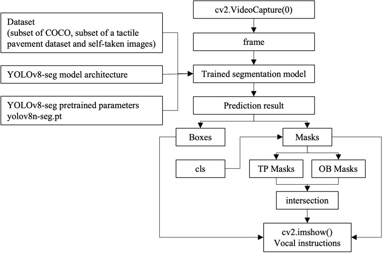

# Tactile Pavement Obstacle Detection Device
Enhancing Urban Accessibility: Tactile Pavement Obstacle Detection Device Utilizing YOLOv8

## Introduction

This project aims to address the issue of obstacles on tactile pavements, particularly concerning the safety and accessibility of visually impaired individuals. Tactile pavements are essential for visually impaired people to navigate public spaces independently. However, in many countries or cities, the tactile pavement is often obstructed, posing significant risks to those who rely on it.

## Project Description

### Problem Statement

Despite the widespread implementation of tactile pavements, many remain ineffective due to poor management and lack of public awareness. This leads to the obstruction of tactile pavements, endangering visually impaired individuals and undermining their independence.

### Solution

To mitigate this issue, we propose a device for detecting obstacles on tactile pavements using the YOLOv8 segmentation model. This device identifies obstacles on the pavement and provides vocal instructions to alert users.

### Implementation Details

- **Model Training**: We trained the YOLOv8 segmentation model using a subset of COCO, a tactile pavement dataset, and additional self-taken images. The model achieved commendable accuracy in recognizing people, bicycles, and tactile pavement, with recognition accuracy exceeding 85% for people and bicycles and 96% for tactile pavement.

- **Functionality**: The project includes a module called `analyze_pred_result` to analyze segmentation results and determine if any obstacles intersect with the tactile pavement. OpenCV is utilized for image processing tasks such as cropping, obstacle classification, colorization, and identifying overlapping regions between obstacles and tactile pavements.

## Repository Structure

- **Main.py**: Main function of our project.
- **train26/**: The final training model of our project.
- **best.py**: The Place-Text file of our model.

## Getting Started

To use the project, follow these steps:

1. Clone the repository.
2. Install the necessary dependencies.
3. Run the `Main.py` to detect obstacles on tactile pavements.

For more details, refer to the project documentation and codebase.
